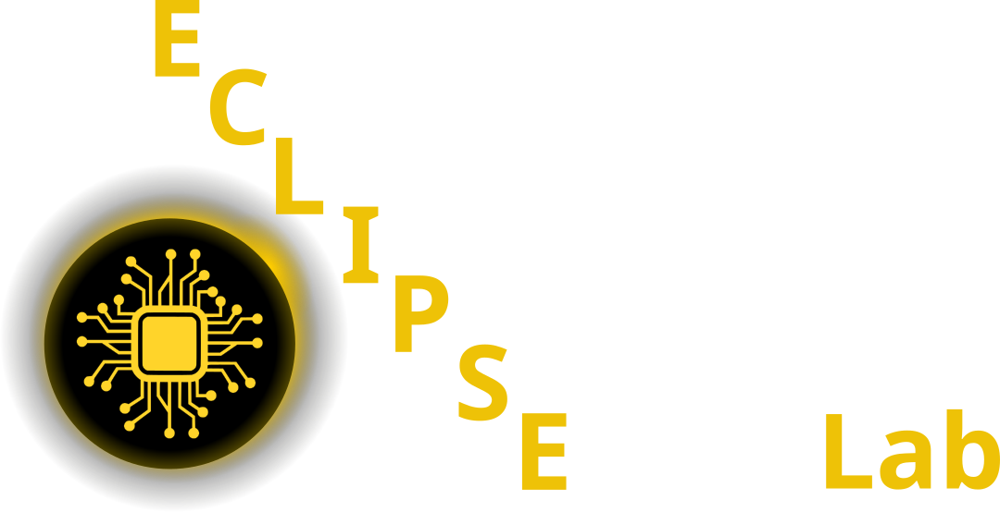

:::: {.columns}

::: {.column width="50%"}
[{width=300}](https://pelzlab.science)
:::

::: {.column width="25%"}
[{width=120}](https://github.com/ECLIPSE-Lab/MaterialsAndStructureSeminar)

**Github Code**
:::

::: {.column width="25%"}
[{width=120}](https://www.studon.fau.de/)

**Studon Link**
:::

::::

:::: {.columns}

::: {.column width="50%"}
[{width=300}](https://pelzlab.science)
:::

::: {.column width="25%"}
[{width=120}](https://github.com/ECLIPSE-Lab/MaterialsAndStructureSeminar)

**Github Code**
:::

::: {.column width="25%"}
[{width=120}](https://www.studon.fau.de/)

**Studon Link**
:::

::::

## Tips for Giving a Great Seminar Presentation

### Preparing Your Presentation
- **Understand Your Audience**  
  Keep in mind that your audience consists of undergraduate students who may not be familiar with complex technical details. Aim for clarity and accessibility.
  
- **Structure Your Presentation Clearly**  
  A good presentation should have:
  - **Introduction** – Briefly introduce the topic and why it matters.
  - **Main Content** – Explain key concepts, methods, and applications.
  - **Case Studies or Examples** – Provide real-world examples to keep the audience engaged.
  - **Conclusion** – Summarize key takeaways and open the floor for discussion.

- **Use Visuals Effectively**  
  - Include **diagrams, charts, and images** to explain complex concepts.
  - Avoid cluttered slides—**less text, more visuals**.
  - Use consistent fonts and colors to maintain readability.

- **Practice Your Timing**  
  - Keep your presentation within the allotted time (typically 10-20 minutes).
  - Rehearse in front of a friend or a mirror to refine your delivery.

### Delivering Your Presentation
- **Speak Clearly and Confidently**  
  - Avoid reading directly from slides or notes.
  - Maintain a steady pace and use pauses for emphasis.

- **Engage with Your Audience**  
  - Make eye contact instead of staring at your slides.
  - Ask rhetorical questions or invite short interactions to keep attention high.
  
- **Manage Nervousness**  
  - Take deep breaths before starting.
  - Use hand gestures naturally to emphasize points.
  - Remember, the audience is there to learn—not to judge you!

### Handling Questions and Discussions
- **Be Prepared for Questions**  
  - Anticipate potential questions and have extra information ready.
  - If you don’t know the answer, admit it and suggest ways to find out.

- **Encourage Participation**  
  - Ask the audience their thoughts or experiences related to the topic.
  - Use real-world scenarios to spark discussion.

### Technical Aspects to Consider
- **Test Your Equipment**  
  - Make sure your slides work on the presentation system in advance.
  - Have a backup plan (e.g., printed notes or USB drive).

- **Use a Strong Opening and Closing**  
  - Start with a **compelling hook**—a question, statistic, or short story.
  - End with a strong statement or a thought-provoking idea.

### Final Reminders
- **Stay Within the Time Limit** – Respect the audience's time.
- **Keep It Simple** – Don’t overload slides with unnecessary details.
- **Have Fun!** – Passion and enthusiasm make a big difference.

By following these tips, you’ll be able to deliver a clear, engaging, and impactful seminar presentation. Good luck!

## Possible Topics

### Popular Science Books on Materials Science

#### General Materials Science
1. **Stuff Matters: Exploring the Marvelous Materials That Shape Our Man-Made World** – *Mark Miodownik*  
   A fascinating exploration of the materials that define our world, from glass to chocolate, written by a materials scientist.
   
2. **The New Science of Strong Materials: Or Why You Don’t Fall Through the Floor** – *J.E. Gordon*  
   A classic introduction to how materials work, explaining why some materials are strong and others are not.
   
3. **Structures: Or Why Things Don’t Fall Down** – *J.E. Gordon*  
   A fun and informative look at the physics of structures, from bridges to bones.
   
4. **Made to Measure: New Materials for the 21st Century** – *Philip Ball*  
   Explores how scientists are designing new materials at the molecular level for future applications.
   
5. **Materials: A Very Short Introduction** – *Christopher Hall*  
   A concise and accessible overview of materials science, from their atomic structure to everyday applications.
   
6. **The Science and Engineering of Materials** – *Donald R. Askeland & Wendelin J. Wright*  
   A comprehensive yet readable textbook covering the fundamental principles of materials science.

#### Nanotechnology & Advanced Materials
7. **Plenty of Room for Everyone: Nanotechnology in the Marketplace** – *Luis E. Liz-Marzán*  
   Examines the real-world applications of nanotechnology and how it is transforming industries.
   
8. **Soft Machines: Nanotechnology and Life** – *Richard A.L. Jones*  
   Explores the connections between nanotechnology and biological systems.
   
9. **Molecular Machines: The Story of Nanotechnology** – *Philip Ball*  
   A deep dive into how scientists are building tiny machines at the molecular scale.
   
10. **Nanotechnology for Dummies** – *Earl Boysen & Nancy C. Muir*  
   A beginner-friendly guide to the science and potential of nanotechnology.
   
11. **The Nanotech Pioneers: Where Are They Taking Us?** – *Steven A. Edwards*  
   Discusses the history and future of nanotechnology, including its ethical and societal implications.

#### Metamaterials & Smart Materials
12. **The Magic of Metamaterials** – *Jürgen Stampfl, Richard W. Siegel, and Hans J. Fecht*  
   Explains how metamaterials with unique properties are changing science and engineering.
   
13. **Metamaterials: Physics and Engineering Explorations** – *Nader Engheta & Richard W. Ziolkowski*  
   A technical yet engaging overview of how metamaterials manipulate electromagnetic waves.
   
14. **Smart Materials and Structures** – *M. V. Gandhi & B. S. Thompson*  
   Covers materials that change properties in response to external stimuli, like shape-memory alloys.

#### History & Social Impact of Materials Science
15. **The Alchemy of Us: How Humans and Matter Transformed One Another** – *Ainissa Ramirez*  
   Shows how materials have shaped human history and culture in surprising ways.
   
16. **Why Things Break: Understanding the World by the Way It Comes Apart** – *Mark E. Eberhart*  
   A look at the science of failure in materials, from airplane crashes to crumbling buildings.
   
17. **The Substance of Civilization: Materials and Human History from the Stone Age to the Age of Silicon** – *Stephen L. Sass*  
   Explores the history of materials and how they have driven human progress.
   
18. **The Elements of Power: Gadgets, Guns, and the Struggle for a Sustainable Future in the Rare Metal Age** – *David S. Abraham*  
   Examines the role of rare metals in modern technology and the geopolitical challenges of securing them.

### Materialism Podcast

#### Fundamentals & Classic Materials Science Topics
19. **Episode 95: You Don't Know Anything About Steel**  
    Steel is foundational to engineering and an excellent topic for materials science students.

20. **Episode 97: Titanium**  
    A widely used material in aerospace and medical fields, great for discussing material properties and applications.

21. **Episode 91: High Entropy Alloys**  
    A modern and rapidly evolving topic in metallurgy, providing insights into novel materials design.

22. **Episode 99: Bulk Metallic Glasses**  
    A fascinating and relatively new class of materials that challenges conventional metallurgy.

23. **Episode 93: An Introduction to Pyrometallurgy**  
    Covers essential metallurgical processes, useful for students interested in materials processing.

24. **Episode 92: The Quest for Pure Uranium**  
    Offers historical and scientific insights into materials purification, with real-world impact.

#### Emerging & Advanced Materials
25. **Episode 94: An Introduction to Quantum Materials**  
    Covers cutting-edge materials with applications in computing and electronics.

26. **Episode 96: Spark Ablation with VSParticle**  
    An advanced materials processing technique, great for discussing nanomaterials.

27. **Episode 86: PHAs and Biodegradable Plastic**  
    Sustainability is a huge topic in materials science, and PHAs are a great case study.

28. **Episode 101: All About Biomatter**  
    Discusses innovative ways to create materials from biological sources, tying into sustainability.

29. **Episode 81: New Materials for Carbon Capture**  
    Addresses a major environmental challenge through materials innovation.

30. **Episode 88: Accelerating Materials Discovery with Microsoft**  
    Explores the intersection of machine learning and materials science.

#### Processing & Manufacturing Techniques
31. **Episode 67: Additive Manufacturing at General Electric**  
    Additive manufacturing (3D printing) is a hot topic with broad applications.

32. **Episode 35: Spark Plasma Sintering**  
    A widely used technique for material densification with interesting scientific principles.

33. **Episode 79: Cryogenic Milling at Cal Nano**  
    A unique and lesser-known method for altering material properties through extreme cooling.

#### Engineering Failures & Case Studies
34. **Episode 90: The Big Dig Incident**  
    Examines the consequences of material selection errors, making it a strong case study for engineering ethics.

35. **Episode 45: Was the Challenger an Engineering Failure?**  
    A major historical failure with deep material science implications.

36. **Episode 42: What Really Sunk the Titanic?**  
    A mix of history and materials science, great for an engaging presentation.

37. **Episode 26: When Materials Failure Leads to Wildfire**  
    Covers the role of materials science in preventing large-scale disasters.

## References {.unnumbered}

::: {#refs}
:::